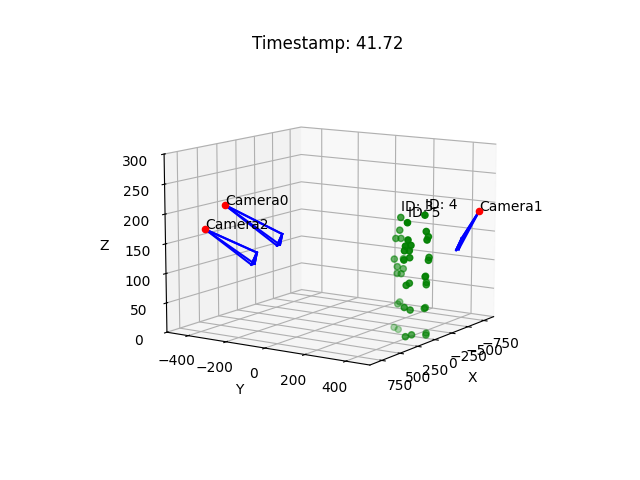

# Multi-View 3D Human Pose Tracking

This project implements the paper ["Cross-View Tracking for Multi-Human 3D Pose Estimation at Over 100 FPS"](https://openaccess.thecvf.com/content_CVPR_2020/papers/Chen_Cross-View_Tracking_for_Multi-Human_3D_Pose_Estimation_at_Over_100_CVPR_2020_paper.pdf) (CVPR 2020).

## Overview

This implementation focuses on multi-person 3D pose estimation and tracking from multiple camera views. The key features include:

- Cross-view tracking for robust 3D pose estimation
- Real-time performance optimization
- Support for multiple people tracking
- Handling of occlusions and view changes

## Dependencies

- Python 3.7+
- PyTorch 
- NumPy
- OpenCV
- Matplotlib
- tqdm

## Dataset Download

You can download the Campus dataset from:
- [Campus Dataset (OneDrive)](https://onedrive.live.com/?authkey=%21AKW9YCvYTyBLxL8&id=415F4E596E8C76DB%213351&cid=415F4E596E8C76DB)

After downloading:
1. Extract the `Campus_Seq1.tar.gz` file
2. Place the extracted `Campus_Seq1` folder in the project root directory
3. The dataset should follow the structure shown above

Note: The Campus dataset contains synchronized videos from three calibrated cameras, along with ground truth 3D pose annotations.

## Dataset Structure

The code supports datasets in the following structure:

## Implementation Details

The main components include:

- `pose_matcher.py`: Cross-view pose matching
- `pose_estimator.py`: 3D pose estimation from 2D detections
- `display.py`: Visualization utilities

### Demo Results

#### Multi-View Camera Setup

The system utilizes multiple synchronized cameras to capture different viewpoints of the scene. This multi-view setup enables:
- Comprehensive coverage of the tracking area
- Better handling of occlusions
- More accurate 3D pose reconstruction

#### 3D Pose Estimation Results

The visualization demonstrates:
- Accurate reconstruction of human poses in 3D space
- Real-time tracking of multiple subjects
- Robust pose estimation across different views

<!-- #### System Demo
[Watch Demo Video](assert/videos/3d_pose.mp4)

The demo video showcases:
- Real-time multi-person tracking
- Cross-view consistency
- Smooth 3D pose reconstruction
- System performance at over 100 FPS -->

### Key Features Demonstrated
1. Multi-view synchronized capture
2. Real-time 3D pose estimation
3. Robust person tracking
4. Occlusion handling
5. High-performance processing

## References

This implementation is based on:

- [Original Paper](https://openaccess.thecvf.com/content_CVPR_2020/papers/Chen_Cross-View_Tracking_for_Multi-Human_3D_Pose_Estimation_at_Over_100_CVPR_2020_paper.pdf)
- [Official Dataset Repo](https://github.com/longcw/crossview_3d_pose_tracking)
- [Unofficial Implementation](https://github.com/Varun-Tandon14/Implementation-of-Cross-View-Tracking-for-Multi-Human-3D-Pose-Estimation-at-over-100-FPS)

## Citation

[1] Chen, Long, et al. "Cross-View Tracking for Multi-Human 3D Pose Estimation at Over 100 FPS." The IEEE/CVF Conference on Computer Vision and Pattern Recognition (CVPR), June 2020.